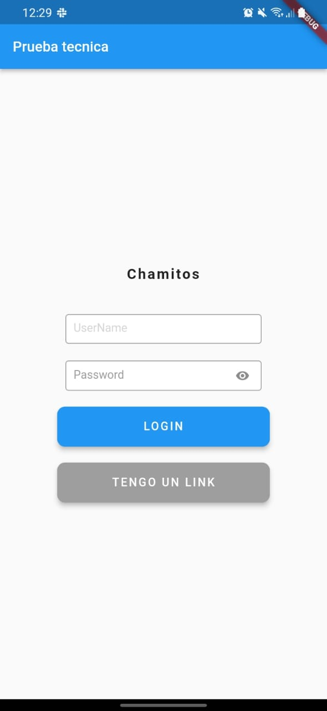
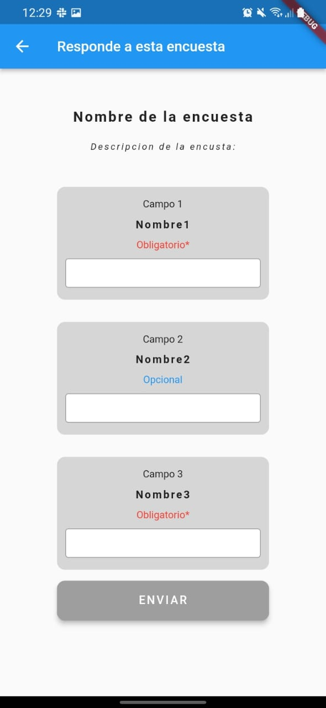
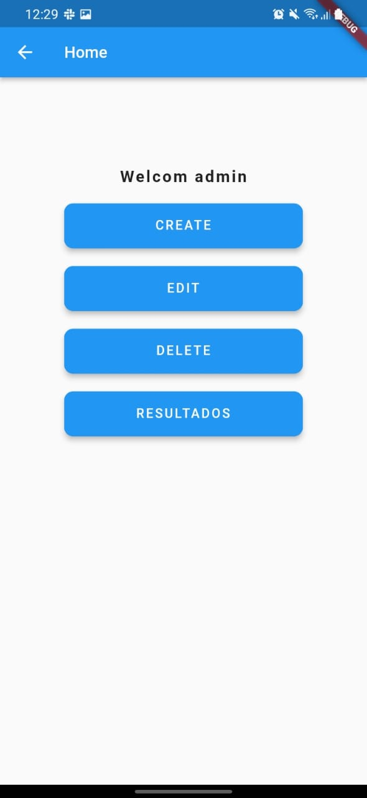
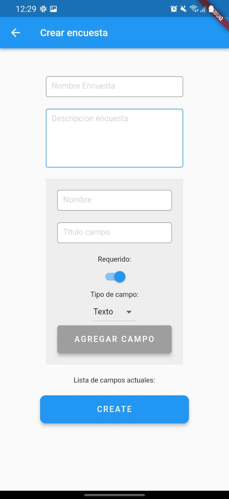
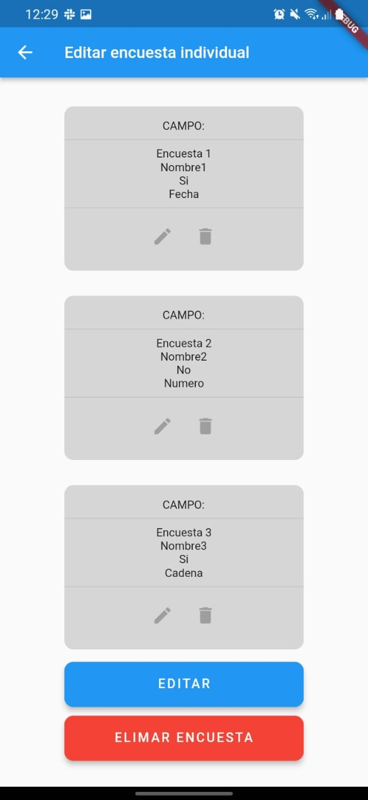

# Encuentas

Contiene un proyecto para administracion de encuestas, para ingresar como administradors es necesario ingresar una credencial, pro defecto se dejo el usuario `admin` y contraseña `admin`.

Acciones posibles:

- Crear encuestas: requiere nomnbre, descripcion y campos dentor de la encuesta.
- Editar encuestas: permite cambiar o eliminar campos en la encuesta,
- Eliminar encuestas: muestra la lista de encuestas disponibles y un boton para suprimir.
- Ver respuestas de encuestas: muestra una lista de encuestas disponibles y un boton para ver cada estadistica.

Pantallas:

- Login
  - Home
    - Crear
    - Editar
    - Eliminar
    - Ver respuestas
- Responder encuesta

